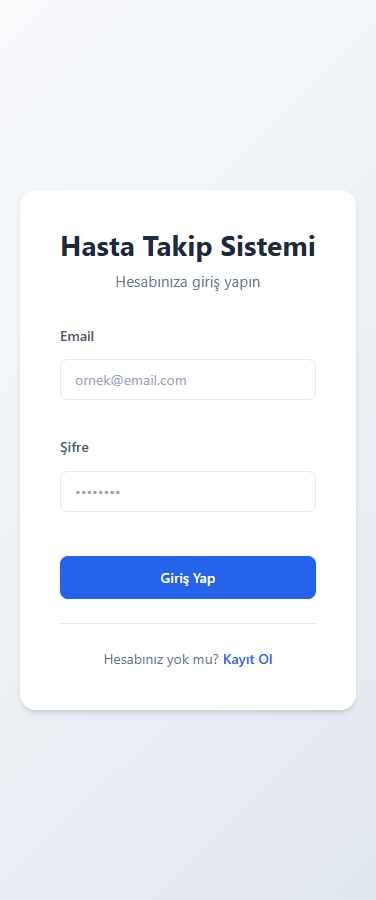
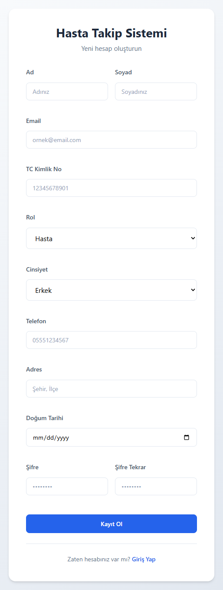

# Patient Tracking System

A full-stack patient tracking application built with Express.js, Prisma, and React.

## Features

- **Role-based Authentication**: Support for Doctors, Patients, and Secretaries
- **User Management**: Registration and login with JWT authentication
- **Gender-based Personalization**: Dashboard displays personalized icons based on user gender
- **Appointment Management**: Track and manage patient appointments
- **Examination Records**: Document diagnoses, treatments, and notes
- **Clinic Management**: Organize doctors and secretaries by clinic

## Screenshots

### Authentication
| Login | Register |
|-------|----------|
|  |  |

### Dashboards

#### Doctor Interface
| Dashboard | My Patients |
|-----------|-------------|
|  |  |

#### Patient Interface
| Dashboard | My Appointments | My Doctor |
|-----------|----------------|-----------|
|  |  |  |

#### Secretary Interface
| Dashboard | Patient List | Appointment Management |
|-----------|--------------|------------------------|
|  |  |  |


## Tech Stack

### Backend
- **Runtime**: Node.js with TypeScript
- **Framework**: Express.js 5
- **ORM**: Prisma 7
- **Database**: SQLite (via LibSQL adapter)
- **Authentication**: JWT + bcrypt

### Frontend
- **Framework**: React 18 with TypeScript
- **Build Tool**: Vite
- **Routing**: React Router DOM
- **HTTP Client**: Axios

## Getting Started

### Prerequisites
- Node.js 18+
- npm or yarn

### Installation

1. **Clone the repository**
   ```bash
   git clone <repository-url>
   cd PatientTrackingSystem
   ```

2. **Install backend dependencies**
   ```bash
   npm install
   ```

3. **Install frontend dependencies**
   ```bash
   cd frontend
   npm install
   cd ..
   ```

4. **Set up environment variables**
   ```bash
   cp .env.example .env
   # Edit .env with your configuration
   ```

5. **Generate Prisma client and push schema**
   ```bash
   npx prisma generate
   npx prisma db push
   ```

### Running the Application

**Backend** (runs on port 3005):
```bash
npm run dev
```

**Frontend** (runs on port 5173):
```bash
cd frontend
npm run dev
```

**Prisma Studio** (database GUI):
```bash
npx prisma studio
```

## Project Structure

```
PatientTrackingSystem/
├── src/
│   ├── config/         # Database configuration
│   ├── controllers/    # Request handlers
│   ├── repository/     # Data access layer
│   ├── router/         # API routes
│   ├── service/        # Business logic
│   ├── types/          # TypeScript interfaces
│   ├── utils/          # Helper functions
│   └── server.ts       # Application entry point
├── frontend/
│   ├── public/
│   └── src/
│       ├── api/        # API client
│       ├── components/ # Reusable React components
│       ├── context/    # React context (Auth)
│       ├── img/        # Application screenshots
│       └── pages/      # React components
│           ├── dashboards/ # Role-specific dashboards
│           ├── Login.tsx
│           └── Register.tsx
├── prisma/
│   └── schema.prisma   # Database schema
└── generated/          # Prisma generated client
```

## API Endpoints

| Method | Endpoint | Description |
|--------|----------|-------------|
| POST | `/api/register` | Register a new user |
| POST | `/api/login` | User login |

## Database Models

- **User**: Base user with role (doctor/patient/secretary), gender, and personal info
- **Doctor**: Speciality and clinic assignment
- **Patient**: Linked to a doctor
- **Secretary**: Manages clinics
- **Appointment**: Scheduled visits between patients and doctors
- **Examination**: Medical records from appointments
- **Clinic**: Healthcare facility

## License

ISC
